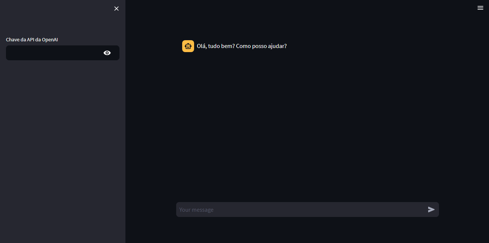
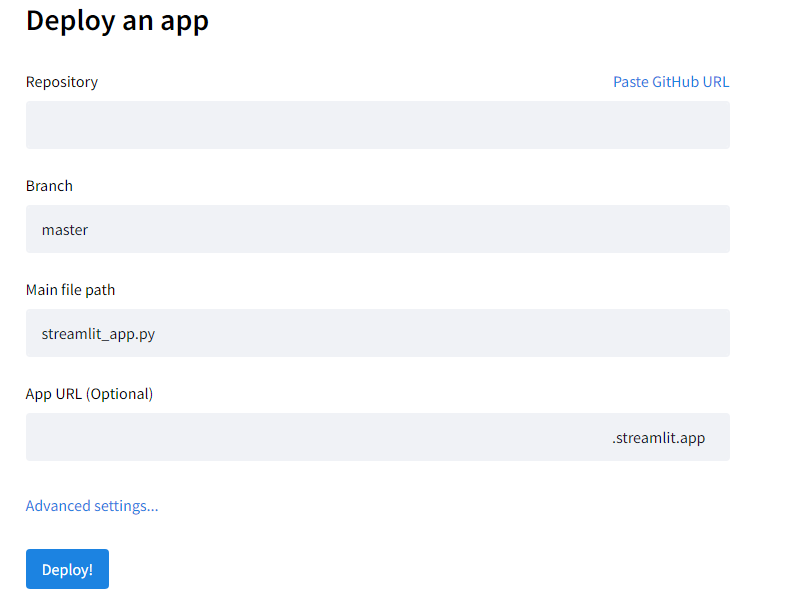

# Suporte ao Cliente através de um Chatbot de IA

Implementar um **chatbot de IA** para fornecer suporte ao cliente automatizado. O chatbot pode ser treinado para compreender e responder a uma variedade de perguntas frequentes, solucionar problemas comuns e direcionar consultas mais complexas para atendentes humanos. Isso permitirá que os clientes recebam respostas instantâneas para suas dúvidas e problemas, reduzindo os tempos de espera e melhorando a experiência do cliente.

[Repositorio do Github](https://github.com/BrunoDorea/cientista_dados_na_pratica)

## Pré-requisitos

1 - Baixar o [Python](https://www.python.org/downloads/).

2 - Baixar o [VS Code](https://code.visualstudio.com/download).

3 - Instalar o ambiente virtual:

```bash
python -m venv chatbot

chatbot\Scripts\activate
```

4 - Instalar os pacotes necessários do Python:

```bash
pip install -r requirements.txt
```

5 - Ter uma conta na [openai](https://openai.com/) e gerar a [API Key](https://platform.openai.com/account/api-keys)

## Desenvolvimento

- Importação dos módulos e classes necessários

```python
from langchain.callbacks.base import BaseCallbackHandler
from langchain.chat_models import ChatOpenAI
from langchain.schema import ChatMessage
import streamlit as st
```

- Define uma classe de callback personalizada que estende a classe BaseCallbackHandler

```python
class StreamHandler(BaseCallbackHandler):
    def __init__(self, container, initial_text=""):
        self.container = container
        self.text = initial_text

    # Este método é chamado sempre que um novo token é gerado pelo modelo de linguagem
    def on_llm_new_token(self, token: str, **kwargs) -> None:
        self.text += token
        self.container.markdown(self.text)
```

- Cria uma barra lateral na aplicação Streamlit para inserir a chave da API da OpenAI

```python
with st.sidebar:
    openai_api_key = st.text_input("Chave da API da OpenAI", type="password")
```

- Se a chave "messages" não estiver presente no estado da sessão, inicializa com uma mensagem padrão do assistente

```python
if "messages" not in st.session_state:
    st.session_state["messages"] = [ChatMessage(role="assistant", content="Fala, beleza? Como posso ajudar?")]
```

- Exibe as mensagens do chat armazenadas no estado da sessão

```python
for msg in st.session_state.messages:
    st.chat_message(msg.role).write(msg.content)
```

- Verifica se o usuário inseriu uma nova mensagem

```python
if prompt := st.chat_input():
    # Adiciona a mensagem do usuário ao estado da sessão
    st.session_state.messages.append(ChatMessage(role="user", content=prompt))
    st.chat_message("user").write(prompt)

    # Se a chave da API da OpenAI não foi fornecida, exibe uma mensagem informativa e interrompe
    if not openai_api_key:
        st.info("Por favor, adicione sua chave da API da OpenAI para continuar.")
        st.stop()

    # Gera uma resposta usando o modelo de linguagem e exibe como mensagem do assistente
    with st.chat_message("assistant"):
        # Cria uma instância de StreamHandler para lidar com atualizações em tempo real da resposta do assistente
        stream_handler = StreamHandler(st.empty())
        
        # Inicializa o modelo ChatOpenAI com a chave da API fornecida e o modo de streaming
        llm = ChatOpenAI(openai_api_key=openai_api_key, streaming=True, callbacks=[stream_handler])
        
        # Gera uma resposta usando o modelo de linguagem e adiciona ao estado da sessão
        response = llm(st.session_state.messages)
        st.session_state.messages.append(ChatMessage(role="assistant", content=response.content))
```

## Executando o StreamLit

No terminal digitar o comando `streamlit run app.py` e aguardar um pouco e o navegador irá abrir na página [http://localhost:8501](http://localhost:8501) para testar a aplicação.



## Deploy

Para realizar o deploy do projeto, é necessário criar uma conta no [streamlit](https://streamlit.io/). Também é necessário adicionar o projeto no [Github](https://github.com/).

Após estar logado no streamlit, clicar em `New app` e realizar a configuração do app.



Ao final desta configuração a aplicação estará no ar para todos utilizarem.
